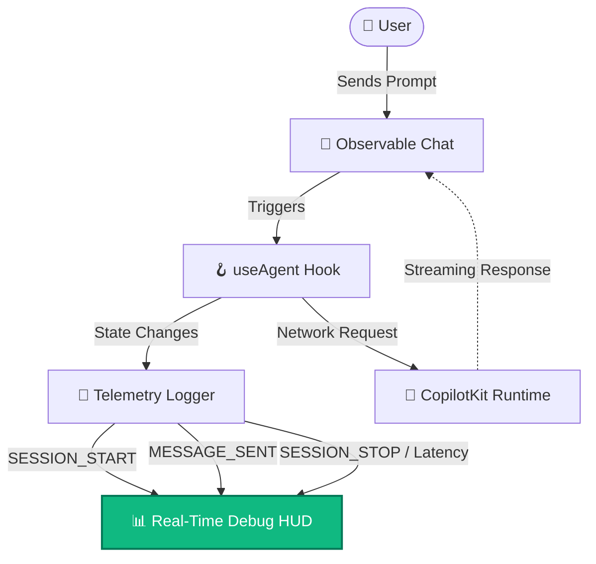

<div align="center">
  
  
  # CopilotKit Observability Hub 🚀
  
  **Open the black box of your AI Agents.**  
  *A companion repository to the ["How to Log CopilotKit Agent Interactions"](BLOG_POST.md) guide.*

  [](https://nextjs.org/)
  [](https://docs.copilotkit.ai/)
  [](https://opensource.org/licenses/MIT)

</div>

---

> [!NOTE]
> Welcome, blog readers! 👋 This repository contains the complete, working code demonstrated in the blog post. You can use this as a boilerplate to add production-grade telemetry, latency tracking, and error monitoring to your own CopilotKit AI agents.

## 🌟 What is this?

When building AI agents, standard server logs aren't enough. You need to know:
- *How long did the LLM take to generate the first token?*
- *What specific tools or MCP servers did the agent invoke?*
- *Did the user regenerate the response?*

This project implements a **Real-Time Telemetry HUD** alongside a CopilotKit chat interface to capture all of this automatically using `useAgent`.

## 🏗️ Architecture at a Glance



---

## 🚀 Getting Started in 3 Minutes

Want to see the telemetry in action? Follow these steps:

### 1. Clone & Install
```bash
# Install dependencies
npm install
# or
yarn install
```

### 2. Configure Environment
Create a `.env.local` file in the root directory and add your LLM provider keys (e.g., OpenAI). Check `.env.local.example` if available.
```env
OPENAI_API_KEY="your-api-key-here"
```

### 3. Launch the Hub
```bash
npm run dev
```

> [!TIP]
> **Try this out:** Open [http://localhost:3000](http://localhost:3000). Type *"Calculate the Fibonacci sequence up to 10"* in the chat. Watch the Telemetry HUD on the right capture the latency, session start, and token metrics instantly!

---

## 🛠️ Key Components to Explore

If you are poking around the source code, here is where the magic happens:

| Component | Location | What it does |
|-----------|----------|--------------|
| **The Telemetry Logger** | `lib/logger.ts` | The typed event emitter that intercepts all agent actions. |
| **Observable Chat** | `components/ObservableChat.tsx` | The wrapper around `<CopilotChat />` that uses `useAgent` to track latency without blocking the UI. |
| **Debug HUD** | `components/DebugPanel.tsx` | The gorgeous right-side panel that visualizes the metrics in real time. |
| **Admin Logs** | `app/admin/logs/page.tsx` | The historical logs commander dashboard for filtering past events. |

## 📖 Further Reading

- Read the full tutorial: [How to Log CopilotKit Agent Interactions](BLOG_POST.md)
- Explore the [CopilotKit Documentation](https://docs.copilotkit.ai/)
- Check out the [CopilotKit VS Code Extension](https://docs.copilotkit.ai/getting-started/quickstart-vscode) for deep IDE integrations.

---
<div align="center">
  <i>Built with ❤️ for the CopilotKit Community</i>
</div>
